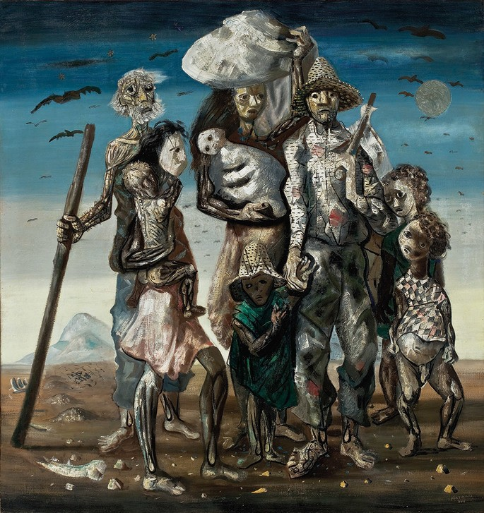
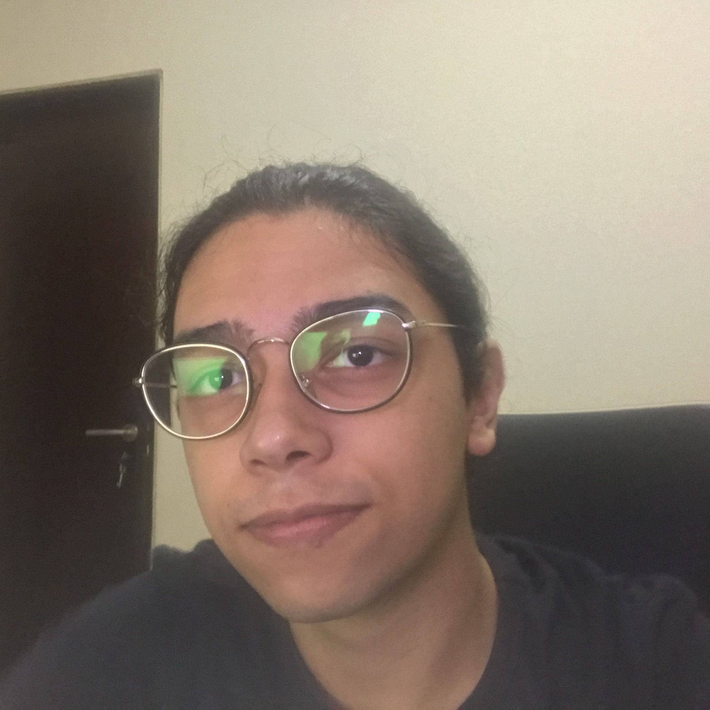
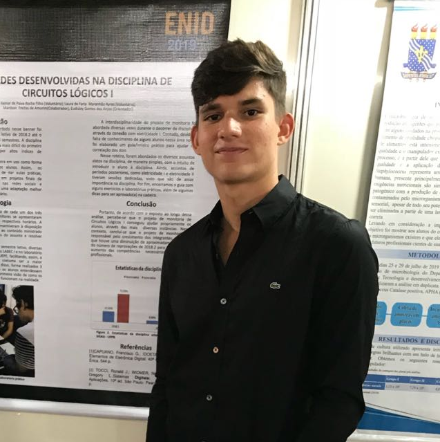
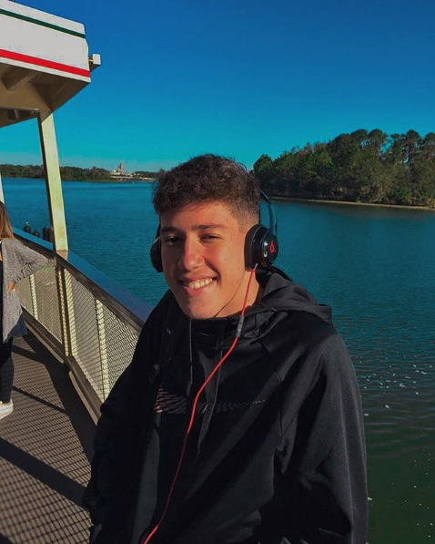

 
 

  

# GANdido Portinari

In this project we trained a CycleGan to reproduce Candido's Portinari style into photos of places and people.

---

## Table of Contents
- [Who was Candido Portinari?](#who-was-candido-portinari?)
- [Data](#data)
- [CycleGan](#cyclegan)
- [Clone](#clone)
- [Authors](#authors)

---

## Who was Candido Portinari?

Candido Portinari was a Brazilian painter. He is considered one of the most important Brazilian painters as well as a prominent and influential practitioner of the neo-realism style in painting.

    

One of his most famous paintings is **Retirantes (1944)**

    

---

## Data

All the data from Candido Portinari work used in this project was collected from [Projeto Portinari](http://www.portinari.org.br/) using a simple download script after discovering the patterns of storage used by the website.

---

## Clone

- Clone this repo to your local machine using
    > https://github.com/ItamarRocha/GANdido-Portinari.git

---
## Authors

|<a href="https://www.linkedin.com/in/jpvt/" target="_blank">**João Pedro Vasconcelos**</a> | <a href="https://linkedin.com/in/itamarrocha" target="_blank">**Itamar Filho**</a>      |<a href="https://www.linkedin.com/in/jo%C3%A3o-wallace-b821bb1b0/" target="_blank">**João Wallace Lucena**</a> | <a href="https://www.linkedin.com/in/felipehonoratodesousa/" target="_blank">**Felipe Honorato**</a>      |<a href="https://www.linkedin.com/in/sheywesk-medeiros/" target="_blank">**Sheywesk Medeiros**</a>      |
|:-----------------------------------------------------------------------------------------:|:---------------------------------------------------------------------------------------:|:-----------------------------------------------------------------------------------------:|:---------------------------------------------------------------------------------------:|:---------------------------------------------------------------------------------------:| 
|                    </img>                            |                </img>                          |                    </img>                            |                </img>                          |                </img>                          |
|               <a href="http://github.com/jpvt" target="_blank">`github.com/jpvt`</a>      |  <a href="https://github.com/ItamarRocha" target="_blank">`github.com/ItamarRocha`</a>  |               <a href="http://github.com/joallace" target="_blank">`github.com/joallace`</a>      |  <a href="https://github.com/Felipehonorato1" target="_blank">`github.com/Felipehonorato1`</a>  |  <a href="https://github.com/sheywesk" target="_blank">`github.com/sheywesk`</a>  |
